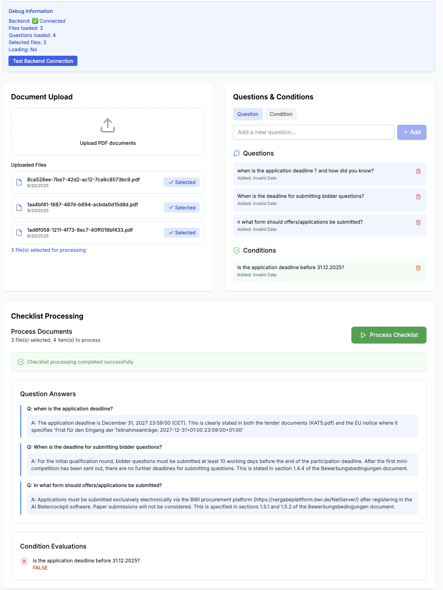

# AI Document Processor

A checklist application for analyzing public tender documents using AI. This application allows users to upload tender documents, define custom questions and conditions, and automatically extract answers and evaluate conditions using advanced language models.

## Features

- **Document Upload**: Upload PDF tender documents to the system
- **Question Management**: Create and manage custom questions and true/false conditions
- **AI Processing**: Automatically extract answers and evaluate conditions using Claude AI
- **File Selection**: Select specific documents for processing
- **Real-time Results**: View question answers and condition evaluations in a user-friendly interface

## Demo

### 🎥 Video Demo
[](docs/examples/demo.mov)

**[Click to watch the demo video](docs/examples/demo.mov)** - See the AI Document Processor in action!

### 📸 Screenshot


*Screenshot showing the AI Document Processor interface with document upload, question management, and results display*

## Technology Stack

### Backend
- **FastAPI**: Modern Python web framework for building APIs
- **Anthropic Claude**: Advanced AI model for document analysis
- **SQLite**: Lightweight database for storing files and questions
- **Python**: Core backend language

### Frontend  
- **Next.js 14**: React framework with App Router
- **TypeScript**: Type-safe JavaScript
- **Tailwind CSS**: Utility-first CSS framework
- **Lucide React**: Icon library

## Architecture

```
┌─────────────────┐    ┌─────────────────┐    ┌─────────────────┐
│   Frontend      │    │   Backend       │    │  Anthropic API  │
│   (Next.js)     │◄──►│   (FastAPI)     │◄──►│   (Claude AI)   │
│                 │    │                 │    │                 │
│ - File Upload   │    │ - File Storage  │    │ - Doc Analysis  │
│ - Question Mgmt │    │ - API Endpoints │    │ - Q&A           │
│ - Results UI    │    │ - Database      │    │ - Evaluation    │
└─────────────────┘    └─────────────────┘    └─────────────────┘
```

## Prerequisites

- Python 3.8+
- pipenv (for Python dependency management)
- Node.js 18+
- npm or yarn

## Quick Start

The fastest way to get started is using the included Makefile:

```bash
# Clone and navigate to the project
git clone <your-repository-url>
cd ai_doc_processor

# Full setup (install dependencies + run migrations)
make setup

# Start both services
make dev
```

This will install all dependencies, run database migrations, and start both the backend (http://localhost:8000) and frontend (http://localhost:3000) automatically.

For more options, run `make help` to see all available commands.

## Database Management

This project uses Alembic for database migrations. Common database commands:

```bash
# Run pending migrations
make migrate

# Create a new migration
make migration MESSAGE="add user table"

# Auto-generate migration from model changes
make migration-auto MESSAGE="update user model"

# Show current migration version
make db-current

# Show migration history
make db-history

# Downgrade by one revision
make db-downgrade
```

## Installation & Setup

### 1. Clone the Repository
```bash
git clone <your-repository-url>
cd ai_doc_processor
```

### 2. Backend Setup

```bash
# Navigate to backend directory
cd backend

# Install Python dependencies with pipenv
pipenv install

# Run database migrations
pipenv run alembic upgrade head

# Start the backend server
pipenv run python main.py
```

The backend server will start on `http://localhost:8000`

### 3. Frontend Setup

```bash
# Navigate to frontend directory (from project root)
cd frontend

# Install Node.js dependencies
npm install

# Start the development server
npm run dev
```

The frontend will be available at `http://localhost:3000`

### 4. Alternative: Using Makefile (Recommended)

Use the included Makefile for easier project management:

```bash
# Install all dependencies
make install

# Start both services concurrently
make dev

# Or start services individually:
make backend    # Start backend only
make frontend   # Start frontend only

# Stop all services
make stop

# See all available commands
make help
```

### 5. Legacy: Quick Start Scripts

Make the scripts executable:
```bash
chmod +x start_backend.sh
chmod +x start_frontend.sh
```

Then run:
```bash
# Terminal 1 - Backend
./start_backend.sh

# Terminal 2 - Frontend  
./start_frontend.sh
```

## Usage Guide

### 1. Upload Documents
- Click on the upload area in the "Document Upload" section
- Select PDF files (supports German tender documents)
- Files are automatically uploaded to Anthropic's file storage

### 2. Manage Questions & Conditions

#### Adding Questions
- Select "Question" tab
- Enter your question (e.g., "In welcher Form sind die Angebote einzureichen?")
- Click "Add" to save

#### Adding Conditions
- Select "Condition" tab  
- Enter a true/false condition (e.g., "Ist die Abgabefrist vor dem 31.12.2025?")
- Click "Add" to save

### 3. Process Documents
- Select the files you want to analyze by clicking "Select" on each file
- Ensure you have added questions and/or conditions
- Click "Process Checklist" to start AI analysis
- Results will appear below showing answers and evaluations

## Example Questions & Conditions

The application comes pre-loaded with these German examples:

### Questions:
1. "In welcher Form sind die Angebote/Teilnahmeanträge einzureichen?" 
   *(In what form should offers/applications be submitted?)*
2. "Wann ist die Frist für die Einreichung von Bieterfragen?"
   *(When is the deadline for submitting bidder questions?)*

### Conditions:
1. "Ist die Abgabefrist vor dem 31.12.2025?"
   *(Is the application deadline before 31.12.2025?)*

## API Endpoints

### File Management
- `POST /upload` - Upload a PDF file
- `GET /files` - Get list of uploaded files

### Question Management  
- `POST /questions` - Create a new question/condition
- `GET /questions` - Get all questions/conditions
- `DELETE /questions/{id}` - Delete a question/condition

### Processing
- `POST /chat` - Chat with Claude using selected files
- `POST /checklist` - Process questions and conditions against documents

## File Structure

```
ai_doc_processor/
├── backend/
│   ├── main.py              # FastAPI application
│   ├── requirements.txt     # Python dependencies
│   ├── .env                # Environment variables
│   └── documents.db        # SQLite database (created on first run)
├── frontend/
│   ├── app/
│   │   ├── layout.tsx      # Root layout
│   │   └── page.tsx        # Main page
│   ├── components/
│   │   ├── FileUpload.tsx          # File upload component
│   │   ├── QuestionManager.tsx     # Question management
│   │   └── ChecklistProcessor.tsx  # Processing & results
│   ├── types/
│   │   └── index.ts        # TypeScript type definitions
│   ├── styles/
│   │   └── globals.css     # Global styles
│   ├── package.json        # Node.js dependencies
│   └── next.config.js      # Next.js configuration
├── Tender documents/       # Sample German tender documents
│   ├── Bewerbungsbedingungen.pdf
│   ├── Fragebogen zur Eignungspruefung.pdf
│   └── KAT5.pdf
├── start_backend.sh        # Backend startup script
├── start_frontend.sh       # Frontend startup script
└── README.md              # This file
```

## Testing with Provided Documents

The application includes three German tender documents for testing:

1. **Bewerbungsbedingungen.pdf** - Application conditions
2. **Fragebogen zur Eignungspruefung.pdf** - Eligibility questionnaire  
3. **KAT5.pdf** - Category 5 specifications

### Test Workflow:
1. Upload all three PDF files
2. Select all uploaded files
3. Use the pre-loaded German questions and conditions
4. Click "Process Checklist"
5. Review the extracted answers and condition evaluations

## Environment Variables

The backend requires the following environment variable (already configured):

```
ANTHROPIC_API_KEY=your_anthropic_api_key_here
```

## Troubleshooting

### Backend Issues
- Ensure Python 3.8+ is installed
- Install dependencies: `pip install -r requirements.txt`
- Check if port 8000 is available
- Verify the Anthropic API key is valid

### Frontend Issues  
- Ensure Node.js 18+ is installed
- Clear npm cache: `npm cache clean --force`
- Delete node_modules and reinstall: `rm -rf node_modules && npm install`
- Check if port 3000 is available

### CORS Issues
- Ensure the backend is running on port 8000
- Frontend must be on port 3000 for CORS configuration

## Production Deployment

### Using Makefile (Recommended)
```bash
# Build and start production services
make build
make prod-backend   # Terminal 1
make prod-frontend  # Terminal 2
```

### Manual Commands
#### Backend
```bash
# Install production dependencies with pipenv
pipenv install

# Run with gunicorn
pipenv run gunicorn main:app --host 0.0.0.0 --port 8000
```

#### Frontend
```bash
# Build for production
npm run build

# Start production server
npm start
```

## Future Enhancements

With more time, these features could be added:

1. **Authentication & User Management**
2. **Advanced File Processing** (Word docs, Excel files)
3. **Batch Processing** of multiple document sets
4. **Export Results** to PDF/Excel
5. **Template Management** for common question sets
6. **Advanced Search** within documents
7. **Multi-language Support**
8. **Real-time Collaboration**
9. **API Rate Limiting & Caching**
10. **Comprehensive Testing Suite**

## License

This project is for evaluation purposes as part of the Forgent AI technical assessment.

## Contact

For questions or issues, please contact the engineering team at Forgent AI.